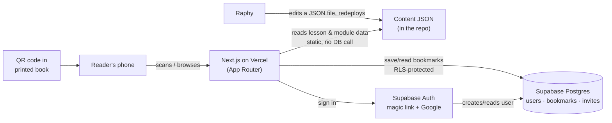

# Architecture — AI Operating System for Leaders website

See PRD.md for product scope. Full visual reference (this content plus the sprint plan and
virtual build team) lives here: https://claude.ai/artifact/Cjqsh7x8V9evMmoiF6zB43



## Stack

- **Frontend/framework**: Next.js (App Router), TypeScript, Tailwind CSS. Static generation
  for all public module/lesson pages — no sign-in and no database call needed to render them.
- **Content**: one JSON file per lesson under `content/m{module}/{lesson}.json`, one per module
  under `content/modules/m{module}.json`. Already extracted from the manuscript — see
  README.md. No CMS needed for v1; Raphy edits these files directly.
- **Database**: Postgres via **Supabase** (see decision below).
- **Auth**: Supabase Auth — magic link + Google OAuth.
- **Hosting**: Vercel, domain aios.obio.in.
- **Server logic**: Next.js Server Actions talking directly to Postgres — no separate API
  server, job queue, or cache layer needed at this scale.

## Design system — connected to Google

On-brand with the book: the same two Google Fonts, the same palette, extended with what Google
requires for sign-in and offers for visibility.

**Typography** (Google Fonts):
```html
<link rel="preconnect" href="https://fonts.googleapis.com">
<link rel="stylesheet" href="https://fonts.googleapis.com/css2?family=Poppins:wght@400;600;700&family=Lora:ital,wght@0,400;0,600;1,400&display=swap">
```
- **Poppins** — headings, nav, buttons, labels (weights 400/600/700)
- **Lora** — body copy and prompt text (weights 400/400-italic/600)

**Color tokens**

| Token | Hex | Use |
| --- | --- | --- |
| Navy | `#12213B` | Header, tab bar, primary text on light backgrounds |
| Gold | `#C8861A` | Accent, active state, CTAs |
| Cream | `#FAF7F0` | Page background |
| Good/open | `#2E7D5B` | "No sign-in needed" tags |
| Warn/gated | `#B5541F` | "Sign-in required" tags |

**Rule — the Google Sign-In button is not restyled.** Google's brand policy requires using its
official rendered button (Google Identity Services: load `https://accounts.google.com/gsi/client`
and render into a container). Only the container may be positioned with our own CSS.

## Google sign-in — setup guide

1. **Create the Google Cloud project** — console.cloud.google.com → New Project → name it
   "AIOS Companion Site".
2. **Configure the OAuth consent screen** — APIs & Services → OAuth consent screen → External
   → app name, support email, logo, aios.obio.in domain.
3. **Create the OAuth Client ID** — Credentials → Create Credentials → OAuth client ID → Web
   application. Authorized redirect URI: `https://<project-ref>.supabase.co/auth/v1/callback`
   (add a `localhost:3000` variant for local dev).
4. **Copy the Client ID and Client Secret** — keep the secret out of git; it goes straight into
   Supabase, never into a repo file.
5. **Enable the provider in Supabase** — Dashboard → Authentication → Providers → Google →
   paste Client ID + Secret → Save.
6. **Set the site URL and redirects** — Authentication → URL Configuration → Site URL
   `https://aios.obio.in`, plus the local dev URL under Additional Redirect URLs.
7. **Test with a real account** — incognito window, a real Gmail address, before this ships.
8. **Publish the consent screen** — move it out of "Testing" once verified, so it isn't limited
   to a hand-picked list of test users.

## Database schema

**users**
| Column | Type | Notes |
| --- | --- | --- |
| id | uuid, pk | from Supabase Auth |
| email | text, unique | |
| display_name | text, null | optional |
| invited_by | uuid, fk→users.id, null | set if joined via `/join` |
| created_at | timestamptz | default now() |

**bookmarks**
| Column | Type | Notes |
| --- | --- | --- |
| user_id | uuid, fk→users.id | composite PK with lesson_id |
| lesson_id | text | e.g. "6.6" |
| saved_at | timestamptz | default now() |

**invites**
| Column | Type | Notes |
| --- | --- | --- |
| inviter_id | uuid, fk→users.id, unique | one code per user |
| code | text, unique | used in `?ref=` |
| joined_count | int | default 0 |

**Day 1, not bolted on later:** row-level security is written into migration `0001_init.sql`.
Policy shape for both `bookmarks` and `invites`: a row is only selectable/writable where
`auth.uid() = user_id` (or `inviter_id`).

## Server actions

| Action | Access | Does |
| --- | --- | --- |
| `getModule(id)` | Public | Reads `content/modules/{id}.json` |
| `getLesson(m, l)` | Public | Reads `content/m{m}/{l}.json` |
| `toggleBookmark(lessonId)` | Session | Insert/delete a row in `bookmarks` |
| `getMyBookmarks()` | Session | Reads current user's `bookmarks` |
| `getOrCreateInviteCode()` | Session | Reads/creates a row in `invites` |
| `getInviterName(code)` | Public | Looks up display name for `/join` landing |

## Project folder structure

```
aios-site/
  app/
    (public)/
      page.tsx                    // home — Raphy designs
      how-to-use/page.tsx
      about/page.tsx               // Raphy designs
      why-this-book/page.tsx       // Raphy designs
      for-business/page.tsx        // Raphy designs
      for-institutions/page.tsx    // Raphy designs
      contact/page.tsx             // Raphy designs
      m/[module]/page.tsx
      m/[module]/[lesson]/page.tsx
    (auth)/
      sign-in/page.tsx
      join/page.tsx
    (account)/
      account/page.tsx
      my-prompts/page.tsx
      account/invite/page.tsx
    layout.tsx
    globals.css
  components/
    Accordion.tsx
    LessonCard.tsx
    CopyButton.tsx
    BookmarkButton.tsx
    GoogleSignInButton.tsx
    SiteHeader.tsx
    SiteFooter.tsx
  content/
    modules/m1.json … m10.json
    m1/01.json … m10/11.json
    all_lessons.json
  lib/
    supabase/client.ts
    supabase/server.ts
    content.ts                    // reads + caches content/
    auth.ts
  supabase/
    migrations/0001_init.sql      // tables + RLS, day one
  middleware.ts                   // refreshes auth session
  next.config.js
  tailwind.config.ts
  .env.local                      // not committed
```

## State plan

- **Content state**: static — read from JSON at build/request time, no client fetch. Republish
  on every content edit; no live revalidation needed for v1.
- **Auth state**: Supabase session lives in an HTTP-only cookie. `middleware.ts` refreshes it
  on every request — never stored in localStorage.
- **UI state**: accordion open/closed and the "Copied!" toast are local component state only.
  The QR-driven expanded lesson comes from the URL, not client state.

## Security — built in from day 1

- RLS enabled on every user table, applied in migration 0001, verified with two test accounts
  before Sprint 1 starts.
- Supabase service-role key stays server-side only, in Vercel environment variables — never in
  the client bundle.
- Passwordless by design: magic link + Google only, nothing to leak in a breach.
- PKCE flow (default in supabase-js v2) protects the OAuth handshake.
- Session cookie: HttpOnly, Secure, SameSite=Lax.
- Smallest possible attack surface in v1: no admin routes, no file uploads, no
  user-generated public content.

## Database decision: Supabase over Neon

Both free tiers comfortably handle 5,000 users — this is a risk decision, not a capacity one.

| | Neon | Supabase |
| --- | --- | --- |
| Free storage | 0.5 GB/project | 500 MB/project |
| Free compute | 100 CU-hours/month; auto-suspends and **auto-resumes in ~200ms**, no action needed | Shared CPU, always on while active |
| Built-in auth (free tier) | Managed Better Auth, up to 60,000 MAU — **still in Beta** | Supabase Auth, up to 50,000 MAU — mature, GA for years |
| Inactivity risk | None | Free projects **pause after 7 days of no activity**, require a manual dashboard click to resume |
| Claude Code fit | Newer pattern, less prior art to build from | Extremely well-trodden with Next.js |

**Recommendation: Supabase.** Its auth is production-mature (accounts shouldn't be the first
thing built on a beta auth product), and its ecosystem depth means an AI coding tool has far
more working examples to build correct code from on the first pass. The known gap — free
projects pausing after a week of inactivity — is real but has a known fix: accept it at this
stage (one manual click if it ever happens), or add a free scheduled ping to keep it warm, and
upgrade to Supabase Pro ($25/month, removes pausing entirely) once traffic justifies it.

## Sprint plan and build team

The AI-speed sprint plan (Sprint 0 through Sprint 5, each with a security checkpoint and a
Definition of Done) and the virtual build/run/deploy/test team with its decision loop are kept
in the visual reference rather than duplicated here — see the link at the top of this file.
